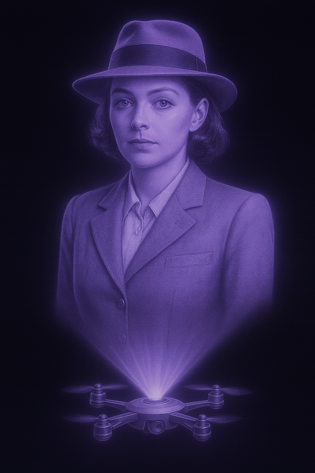

# An Unexpected Party

You can't drive fast along the valley. The road isn't paved, and there are places where the rain washes deep ruts right across the road. From time to time someone, usually Oleksiy or Forest, would take a tractor and fill the ruts and potholes with a mix of gravel, decomposed granite and a little bit of clay. But until they got out there, after rain it was a mess. 

Sophia was going a bit fast when she re-learnt this for the four-hundredth time. She didn't quite lose control, she was going fast enough to float over the potholes. But it was just as well she had the bend to herself, because she was on the wrong side of the road when the shuddering stopped.

No traction for more than a second, but coming out of the bend she was perfectly lined up. What she didn't know was this was mostly because Autumn was in her augs, looking out her eyes, subtly interfering with her vehicle to set up for the corner.

She didn't know, but it was enough of a shock that she backed off the throttle. She stayed off the throttle, cresting a rise and braking to turn up into the carpark of her stacked demountable empire.

Retreating to the sanctuary of her office, she flumped in the big black chair and closed her eyes. It didn't work: the phone promptly rang, as though someone were watching from some hidden camera. Surveillance was normal, just not in the lair of the monster at the top of the food chain. And what _that_ implied was unsettling.

"Project Liaison Hachia." She _was_ annoyed, and it was the right tone for the impertinence of monitoring her.

"Long day, Sophia?"

"Very. I've been living out _Attack of the Killer Tomatoes_. To what do I owe the pleasure? It's not like you to be in the office this late."

"I trust you got my email." Hollywood might have given him a cultured and slightly prissy British accent that spoke of money and privilege. Reality knew better than to polish a turd. He tried for posh but only managed smug.

"Yes. What were you hoping I'd do about it? He's a _Vanguard_."

"Did you _read_ it?"

"Yes. It's a manifesto of inaction. He thinks the government is a bunch of controlling assholes, which is spot on, then he says there's no need to take action because pop will eat itself. Which is the opposite of rebellion."

"A very smart lady I know described them as 'a bunch of militantly independent hippies thumbing their noses at us from the wilderness'."

"Quite. I stand by that, it's accurate."

"By their very existence they undermine our authority."

"Weren't you the one who told me sovereignty boils down to ability to enforce? If they _can_ undermine your authority then you don't have any.

"He's happy living in a caravan in the bush caretaking his AI's Little Shop of Horrors. All you have to do is nothing and he'll stay there. Or you could poke the bear and see what happens. By all accounts you are _not_ an idiot. So what do you really want?"

"I want you to remember who you are, and watch him like a hawk." The line went dead. Staring at her phone, she cleaned it with a tissue, an act more symbolic than fastidious.

She drove back, rather more carefully, to be there when the ground team arrived. Eric wandered out holding a glass of something, ducked back in and emerged with two. He wordlessly held one out and she thanked him.

"What are we going to do, Eric?"

"Generally, people look to _you_ for answers like that."

"Do you know why they sent me here?"

"Hardly, it's above my pay grade. Yesterday I would have said 'to assess and control a threat' but clearly the threat has already _been_ assessed."

"And probably can't be controlled. Which doesn't matter: I'm no longer sure _he's_ the threat. He lives in a forest, takes nothing and asks nothing while giving everything."

"Did you read the whole thing?"

"Yes. Did you?"

"Yes. It has author notes now!" They both drank. It was heady stuff. Both Forest and Oleksiy kept bees. They brewed mead in Oleksiy's long shed, a gloomy dungeon of a thing half-buried in the hillside.

Eric changed the subject. "Ask Autumn why she looks like Cortana."

"Like who?"

"Just ask, she'll explain that too."

"The manifesto, what do you think of it?"

"I think he may be right."

"So he's going to launch a first-strike then?"

"What?! How did you get that out of it? He goes on at length about how centralisation is self-defeating and all they have to do is sit tight out here in the boonies."

"Did you _read_ it or skim it?"

"Well..."

"There's a section about how falling empires grab all the resources to prop themselves up while they die. He thinks a quick kill is necessary to avoid going down with the ship of state."

She chugged half of the mead, an act of courage verging on folly. "Should I confront him, ask the question?"

"Ask what question?" Forest appeared out of the darkness and grinned at her. "Whatever it is, ask it inside, it's chilly out here. Oleksiy's got the fire going and Sissi's laid on a spectacular. Come inside and relax. Ground team's forty minutes out and the dining table's not going to fit us all so while you have some drinks we're setting up the long table in the garden, with and the braziers and some gas heaters."

Trixie was there. She had a G&T. "Mead? Really?" She found another G&T, replaced Sophia's drink and took her under one wing, steering her into the walled garden where Forest and Oleksiy heaved two halves of a massive timber table into line. Typhoon Sissi chased them out of the way to sweep it and fling tablecloths into place, vanishing as quickly as she appeared.

"Sometimes I think he is a force of nature. But I've also seen him struggle with simple things. He has big ideas. Sometimes he talks, sometimes he does. People think he's some kind of saint but he does all those things to make the world suit _him_. He just _seems_ good because the world he wants to live in is a nice place."

"So... he runs around selfishly trying to make the world a better place?"

Trixie laughed out loud. "I suppose so."

Rice appeared, wafting jasmine plumes into the night air. Eric and two of his lads staggered out with trays of mismatched crockery that steamed and filled the wind with promises to bring tears to their eyes, in some cases literally.

"Red dish much chilli!" admonished Sissi, clearly enjoying herself. "Sugar on table."

"Sugar?" puzzled Project Liaison Hachia.

"Calms the chilli," boomed Forest from ten metres away. "Still burns going out."

"That sounds like the Galya." 

A blaze of lights roared out of the night sky, setting down in the carpark, and five men boiled out of it piled high with bonhomie and pizza boxes. "Holy shit that thing goes through some fuel! Thanks, Mr K, after Fallujah I never thought I'd fly another one. That was fun!"

"I'm pretty sure I know _why_ it used so much juice," said a faceless stack of pizza, trudging down the drive. "_Someone_ likes to play with his joystick."

"What did you break?" Forest again, easily heard over the convivial hubbub.

"Bunch of records, and Shorty's nerve. You reckon Oleksiy can lend him fresh undies?"

"Nah, let him stew."

"I'm right here, you pricks" said the pizza, entering the house.

---

Eric leaned closer to Forest, lowering his voice. "So, you wrote that."

Forest smiled. "Guilty as charged."

"You really believe all that about decentralisation and letting the system collapse under its own weight?"

Forest shrugged. "It's never not happened. Civilisations rise. Without exception, they fall. Why?"

"You're saying that in every last case the cause was centralisation?"

"Yes."

"How could you possibly know that? You weren't there."

"Can you rely on people to be greedy, lazy and stupid?"

"That's a bit cynical&mdash;"

"Very cynical. But is it true? Can you rely on people to be greedy and lazy?"

"Not _all_ of them. But on the whole, I guess so."

"Centralisation concentrates wealth and power, right?"

"Yes?"

"You're hungry and poor. Is it worth robbing Janna?"

"She'd feed me to the pigs! And she's nice, I wouldn't have to rob her, she'd help me out."

"Quite. You'd be better off asking for a meal and mucking the pens. Now imagine you hardly knew her and the pigs shit solid gold. Worth robbing her? She has far more than she needs and you could be rich!"

"Certainly worth a try.

"Won't she feed you to the pigs?"

"Yes, but the reward is so much greater. I just need to be smarter about it... oh, I see. And you're saying centralisation makes the pigs shit gold."

"And anonymity dehumanises us. Societies bigger than a village are demeaning. They make us strangers, and strangers don't care about strangers ."

"Nobody has any privacy in a village! Everyone knows everyone's business. There's no escape!" 

"Like living with your parents."

"Yes! No privacy!"

"Your parents, who care about you and can be relied on to help you? Friends and family kind of thing?"

"But what about the bit about putting society down like a sick dog? How did you get to that?"

Forest's expression darkened slightly. "It's a thought experiment, Eric. A way to explore the consequences of action versus inaction. Doesn't mean I'm planning anything."

"Thought experiments have a way of becoming blueprints," Eric countered. "Especially when people start agreeing with them."

Forest sighed. "Look, the manifesto is about survival, not rebellion. If people take it as a call to arms, that's on them, not me. I just want to live in a world that makes sense."

Eric studied him for a moment. "And if the world doesn't make sense?"

Forest smiled faintly. "Then I keep planting trees and fixing potholes. One small piece at a time."

As Eric wandered off, Forest reflected that sooner or later the state would try to assert dominance. If he let them seize the initiative they would destroy everything he cared about. They'd already made one attempt, sending Sophie and Eric and all their research and security staff. He'd managed to suborn that, which surely hadn't gone unnoticed.

The problem was, they were self-reliant, not self-sufficient. You can't tear down the system unless you are ready to replace it.

"Autumn, have you ever tried the _agent provocateuse_ look?"

> _Are we talking Mata Hari or Black Widow?_

"Whatever works best. We're going to make some trouble."

The Cortana look vanished altogether. The joke was long over, anyway. Her new look owed a lot to Ingrid Bergman.

"You really _have_ watched all my movies."

> _You're still getting battle music, because I like pushing your buttons._

No change in her voice, but in the background Sam played _As Time Goes By_ for the millionth time.

"You look great."

> _I am great._
